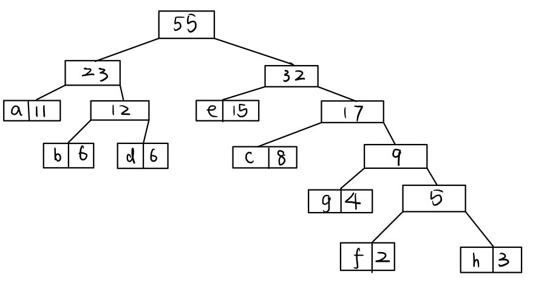

# 中期检查
1. 已知字⺟ a, b, c, d, e, f, g, h 的出现次数分别为 11, 6, 8, 6, 15, 2, 4, 3，且⽂件中仅存在这些字⺟。请据此绘制相应的哈夫曼树（电⼦版或⼿绘版并拍摄皆可），并给出每个字⺟对应的哈夫曼编码。
   
   
   每个字对应的哈夫曼编码为：
   ```
   a: 00    b: 010    c: 110    d: 011    e: 10    f: 11110
   g: 1110    h: 11111
2. 如何根据⽂件的字节流，构建哈夫曼树？

    + step1
        
        利用`istream::read`成员函数读文件，同时记录0~255每个字节出现的频率。
    + step2

        将出现过的字节编号，并把它们的出现频率与编号存入结点类中。
    + step3

        每次选出最小的两个结点，构造其父节点：左儿子为较小的结点，右儿子为较大的结点，值为左右儿子值的和，将三个结点并入哈夫曼树。重复该操作，直到所有结点都在哈夫曼树内。
3. 构建哈夫曼树的过程中，如何每次⾼效、便捷地选出出现频率最低的两个节点？

     可以维护一个关于字节频率的小根堆，每次取出两次根，合并而且进行并入哈夫曼树操作后再插入堆中，直到堆中只有一个元素结束。这样构建哈夫曼树的时间复杂度为`O(NlogN)`。
4. 如何将哈夫曼树存储到⽂件？
    
    只需将字节频率写入压缩文件头部信息中，解压时再根据字节频率构建哈夫曼树。
5. 如何完成⽂件夹的压缩并保留内部⽂件名等信息的⼀致性？

    对于文件夹压缩的情况，可以将文件夹的结构抽象为一棵树（各级文件夹为内部节点，文件为叶子节点），在压缩文件头中储存这棵树，表示文件的叶子节点储存压缩文件中该原文件对应的数据起始与结束位置。
6. 于⽂档中附上⽬前代码完成情况的主体部分，并做简略的说明。
    
    目前完成了Huffman树的构建， Huffman编码的获取， 单个文件的压缩与解压。
    + Huffman树的构建
        ```cpp
        void huffman::create(std::vector<node*>& byteVector)
        {
            if(byteVector.empty())
            {
                std::cout << "Warning: You are trying to compress a empty file!" <<std::endl;
                return;
            }
            
            std::priority_queue<node*, std::vector<node*>, decltype(&cmp)> heap(cmp);
            for(auto i :byteVector)
                heap.push(i);
            nodeCount = heap.size();
            while(heap.size() >= 2)
            {
                node* newLeft = heap.top();
                heap.pop();
                node* newRight = heap.top();
                heap.pop();
                node* newFather = new node(-1, newLeft->getVal() + newRight->getVal(), newLeft, newRight);
                heap.push(newFather);
            }
            root = heap.top();
        }
        ```
        维护一个关于字节频率的小根堆，每次取出两次根，合并而且进行并入哈夫曼树操作后再插入堆中，直到堆中只有一个元素结束。这个元素即Huffman树的根节点。这样构建哈夫曼树的时间复杂度为`O(NlogN)`。

    + Huffman编码的获取
        ```cpp
        std::map<char,std::string> huffman::getHuffmanCode()
        {
            std::queue<node*> Queue;
            Queue.push(root);
            std::map<char,std::string> huffmanCode;

            while(!Queue.empty())
            {  
                node* cur = Queue.front();
                Queue.pop();
                        
                if(cur->getLeft() != nullptr)
                {
                    cur->getLeft()->code = cur->code + '0';
                    Queue.push(cur->getLeft());
                }
                if(cur->getRight() != nullptr)
                {
                    cur->getRight()->code = cur->code + '1';
                    Queue.push(cur->getRight());
                }
                if(cur->isLeaf())
                {
                    huffmanCode[cur->getIdx()] = cur->code;
                }
            }
            return huffmanCode;
        }
        ```
        层次序遍历Huffman树，同时将从根节点到当前结点的路径储存在`std::string code`中（向左记为0，向右记为1），找到叶节点时将该字节序号到`code`的映射加入到` std::map<char,std::string> huffmanCode`中。因而`huffmanCode`中储存了所有出现过的字节到Huffman编码的映射。
    + 单个文件的压缩
    
        通过构建类`comp`实现

        ```cpp
        comp::comp(std::string in, std::string out)
        {
            fileName = in;
            auto const pos = in.find_last_of('.');
            extension = in.substr(pos);
            byteCount = 0;
            byteType = 0;
            inFile = std::ifstream(in,std::ios::in | std::ios::binary);
            outFile = std::ofstream(out,std::ios::out|std::ios::binary);
        }
        ```

        comp类的构造函数，为成员变量初始化。
    
        ```cpp
         if(!inFile)
        {
            std::cout << "error: failed to read file" << std::endl;
            return 1;
        }
        unsigned char c = '\0';
        while(inFile.read((char*)&c, sizeof(char)))
            byteCount ++;
        inFile.close();
        if(byteCount == 0)
        {
            return 0;
        }
        bool bigFile = byteCount > 1 << 30;
        //std::cout << byteCount << std::endl;
        long long readPos = 0;
        std::vector<unsigned char> fileData(1<<21);
        freq = std::vector<long long>(256);
        inFile.open(fileName, std::ios::in | std::ios::binary);
        while(inFile.read((char*)&c, sizeof(char)))
            freq[(int)c]++;
        inFile.close();
        for(int i = 0; i < 256; i++)
        {
            if(freq[i] != 0)
                byteType++;
        }
        return 0;
        ```
        `comp::readFile()`从源文件中逐字节读取数据并获取字节种类`byteType`, 字节总数`byteCount`, 字节出现频率`freq[]`。

        ```cpp
        int comp::huffmanEncode()
        {
            //create huffmanTree
            std::vector<node*> byteVector;
            for(int i = 0; i < 256; i++)
            {
                if(freq[i] != 0)
                {
                    byteType ++;
                    node* tmp = new node(i, freq[i], nullptr, nullptr);
                    byteVector.push_back(tmp);
                }
            }

            huffmanTree.create(byteVector);

            std::map<char,std::string> huffmanCode;
            huffmanCode = huffmanTree.getHuffmanCode();
            return 0;
        }
        ```
        通过字节频率构建Huffman树。
    
        ```cpp
        int comp::writeHead()
        {     
            //Write the head infomation (include byte frequencies) into file.
            std::string headTag = "Produced By SY Compress Program.";

            outFile.write((char*)headTag.c_str(), sizeof(headTag));

            outFile.write((char*)&byteType, sizeof(byteType));
            outFile.write((char*)&byteCount, sizeof(byteCount));

            int lenOfFileName = sizeof(fileName);
            outFile.write((char*)&lenOfFileName, sizeof(lenOfFileName));
            outFile.write((char*)fileName.c_str(), sizeof(fileName));

            for(int i = 0; i < 256; i ++)
            {
                if(freq[i])
                {
                    outFile.write((char*)&i, sizeof(i));
                    outFile.write((char*)&freq[i], sizeof(freq[i]));
                }
            }
            //The head info should occupy sizeof(headTag) + sizeof(byteType) + sizeof(byteCount) + sizeof(lenOfFileName) + sizeof(fileName) + byteType*5
            return 0;
        }
        ```
        将压缩标志， 字节总数，字节种类数， 源文件名长度， 源文件名， 字节频率数组写入到压缩文件头部信息中。

        ```cpp
        int comp::writeBody()
        {
            if(byteCount == 0)
                return 0;
            //Write the huffmanCodes into file.
            char byte = '\0';
            bool isByteEmpty = true;
            int bitIndex = 0;
            if(huffmanTree.getRoot() == nullptr)
                return 1;
            huffmanCode = huffmanTree.getHuffmanCode();
            inFile.open(fileName, std::ios::in | std::ios::binary);
            for (int i = 0; i < byteCount; i++)
            {
                int codeIndex = 0;
                char tempChar = '\0';
                unsigned char cc;    
                inFile.read((char*)&cc, sizeof(char));
                std::string code = huffmanCode[cc];
                while (codeIndex <  code.length())
                {
                    char bit = code[codeIndex] - '0';
                    byte |= (bit <<  (7 - bitIndex) );
                    bitIndex ++;
                    codeIndex ++;
                    isByteEmpty = false;
                    if (bitIndex == 8)
                    {
                        outFile.write((char*)&byte, sizeof(byte));
                        byte = '\0';
                        isByteEmpty = true;
                        bitIndex = 0;
                    }
                }
            }
        
            if(!isByteEmpty) 
            {
                outFile.write((char*)&byte, sizeof(byte));
            }
            inFile.close();
            outFile.close();
            return 0;
        }
        ```
        根据构建的Huffman编码逐字节压缩源文件正文。

        ```cpp
        int comp::work()
        {
            if(!this->readFile())
            {
                if(!this->writeHead())
                {
                    if(!this->huffmanEncode())
                        this->writeBody();
                }
            }
            return 0;
        }
        ```
        利用上述方法压缩单个文件。

    + 单个文件的解压

        通过`uncomp`类实现
        ```cpp
        uncomp::uncomp(std::string in)
        {
            fileName = in;
            byteCount = 0;
            byteType = 0;
            inFile = std::ifstream(in,std::ios::in | std::ios::binary);
        }
        ```
        uncomp类的构造函数

        ```cpp
        int uncomp::readHead()
        {
            if(!inFile)
            {
                std::cout << "error: failed to read file" << std::endl;
                return 1;
            }
            unsigned char c = '\0';
            while(inFile.read((char*)&c, sizeof(char)))
                byteCount ++;
            inFile.close();
            
            inFile.open(fileName, std::ios::in | std::ios::binary);
            std::string tag;
            const std::string headTag = "Produced By SY Compress Program.";
            for(int i =0; i < headTag.length(); i++)
            {
                inFile.read((char*)&c, sizeof(char));
                tag.push_back(c);
            }

            if(tag != headTag)
            {
                std::cout << "This is NOT produced by my program!" << std::endl;
                inFile.close();
                return 1;
            }

            inFile.read((char*)&byteType, sizeof(byteType));
            inFile.read((char*)&byteCount, sizeof(byteCount));

            int lenOfFileName;
            inFile.read((char*)&lenOfFileName, sizeof(lenOfFileName));
            char* filename = (char*)malloc((lenOfFileName + 1) * sizeof(char));
            inFile.read((char*)(filename), lenOfFileName);
            fileName = filename;
            free(filename);
            outFile = std::ofstream(fileName,std::ios::out|std::ios::binary);
            freq = std::vector<long long>(256,0);
            if(byteCount == 0)
            {
                inFile.close();
                return 1;
            }
            for(int i =0; i < byteType; i ++)
            {
                int j;
                inFile.read((char*)&j, sizeof(j));
                inFile.read((char*)&freq[j], sizeof(freq[j]));
            }
            return 0;
        }
        ```
        `readHead()`读取压缩文件的头部信息同时更新`uncomp`的成员变量

        ```cpp
        int uncomp::huffmanEncode()
        {
            std::vector<node*> byteVector;
            for(int i = 0; i < 256; i++)
            {
                if(freq[i] != 0)
                {
                    node* tmp = new node(i, freq[i], nullptr, nullptr);
                    byteVector.emplace_back(tmp);
                }
            }

            huffmanTree.create(byteVector);
            return 0;
        }
        ```
        通过读取到的字节频率信息得到Huffman编码

        ```cpp
        int uncomp::write()
        {
            unsigned char c;
            node* cur = huffmanTree.getRoot();
            unsigned char curByte = '\0';
            int curBitIndex = 0;
            int i = 0;
            long long pos = 0;
            while(inFile.read((char*)&curByte, sizeof(char)))
            {
                while(curBitIndex != 8)
                {
                    if(pos >= byteCount)
                        break;
                    int curBit = ( curByte >> (7 - curBitIndex) ) &  1 ;
                    curBitIndex ++;
                    if(curBit == 0)
                    {
                        cur = cur->getLeft();
                    }
                    else if(curBit == 1)
                    {
                        cur = cur->getRight();
                    }
                    if(cur->isLeaf())
                    {
                        char tmp = cur->getIdx();
                        outFile.write((char*)&tmp, sizeof(tmp));
                        pos ++;
                        cur = huffmanTree.getRoot();
                    }
                }
                if(curBitIndex == 8)
                {
                    curBitIndex = 0;
                }
            }
            outFile.close();
            return 0;
        }
        ```
        通过逐bit遍历Huffman树还原文件信息

        ```cpp
        int uncomp::work()
        {
            if(!this->readHead())
                if(!this->huffmanEncode())
                    this->write();
            return 0;
        }
        ```
        利用上述函数进行单个文件的解压。